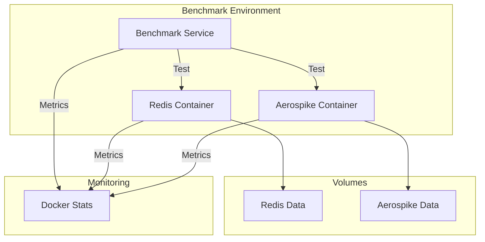
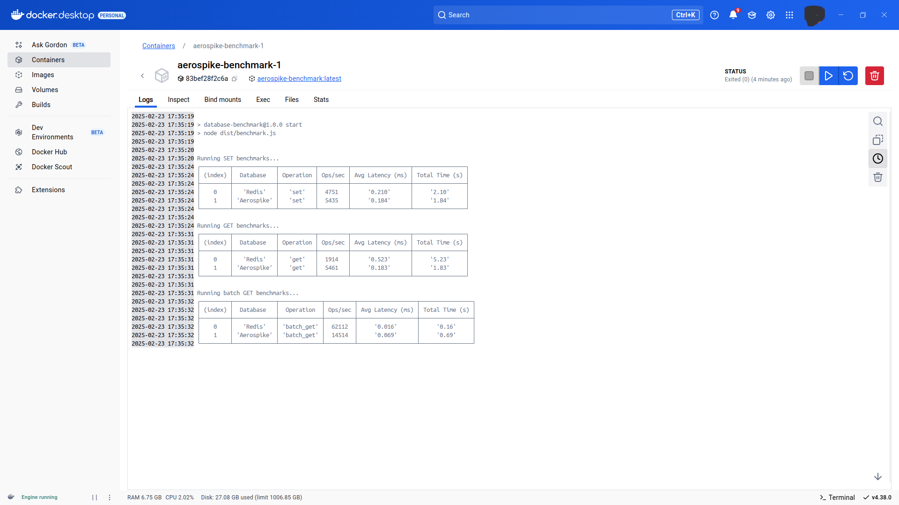

# Redis vs Aerospike Performance Benchmark

A comprehensive performance comparison between Redis and Aerospike databases using TypeScript and Docker.


## Table of Contents
- [Overview](#overview)
- [Architecture](#architecture)
- [Prerequisites](#prerequisites)
- [Installation](#installation)
- [Configuration](#configuration)
- [Usage](#usage)
- [Benchmark Operations](#benchmark-operations)
- [Results](#results)
- [Monitoring](#monitoring)
- [Troubleshooting](#troubleshooting)
- [Contributing](#contributing)
- [License](#license)

## Overview

This project provides a containerized benchmark environment to compare the performance characteristics of Redis and Aerospike in various operations including:
- Single key operations (SET/GET)
- Batch operations
- Different data sizes
- Concurrent access patterns

## Architecture



## Prerequisites

- Docker Engine 20.10+
- Docker Compose v2.0+
- Node.js 18+ (for local development)
- 4GB RAM minimum
- 10GB free disk space

## Installation

1. Clone the repository:
```bash
git clone https://github.com/nhassan/redis-aerospike-benchmark.git
cd redis-aerospike-benchmark
```

2. Start the containers:
```bash
docker compose up --build
```

## Configuration

### Environment Variables

```env
REDIS_HOST=redis
REDIS_PORT=6379
AEROSPIKE_HOST=aerospike
AEROSPIKE_PORT=3000
```

### Resource Limits

Each service has the following resource allocations:

```yaml
limits:
  cpu: 0.5
  memory: 250M
reservations:
  cpu: 0.25
  memory: 152M
```

### Service Configurations

#### Redis
- Port: 6379 (internal)
- Persistence: Enabled (appendonly)
- Protocol: Redis Serialization Protocol (RESP)

#### Aerospike
- Primary Port: 3000
- Mesh Port: 3001
- Info Port: 3002
- Storage Engine: Memory
- Namespace: test

## Usage

### Starting the Benchmark

```bash
# Start all services
docker compose up --build

# Run specific benchmark
docker compose exec benchmark npm run benchmark
```

### Stopping Services

```bash
# Stop and remove containers
docker compose down

# Stop and remove containers + volumes
docker compose down -v
```

## Benchmark Operations

The benchmark includes the following tests:

1. **Single Operations**
   - SET operations
   - GET operations
   - DELETE operations

2. **Batch Operations**
   - Batch GET (1000 keys)
   - Batch SET (1000 keys)

3. **Data Size Tests**
   - Small payloads (100 bytes)
   - Medium payloads (1 KB)
   - Large payloads (10 KB)

## Results

Results are displayed in a table format showing:
- Operations per second
- Average latency
- Total execution time
- Memory usage

Example output:
```
Running SET benchmarks...
Database   | Ops/sec  | Avg Latency (ms) | Total Time (s)
-----------|----------|------------------|---------------
Redis      | 95,000   | 0.0105          | 10.52
Aerospike  | 85,000   | 0.0117          | 11.76
```



## Monitoring

Monitor performance metrics using:

```bash
# View container stats
docker stats

# View service logs
docker compose logs benchmark
docker compose logs redis
docker compose logs aerospike
```

## Troubleshooting

Common issues and solutions:

1. **Connection Refused**
   - Check if services are running: `docker compose ps`
   - Verify network connectivity: `docker network inspect benchmark-network`

2. **Memory Issues**
   - Increase Docker memory limit
   - Check container logs for OOM errors

3. **Performance Issues**
   - Verify host system resources
   - Check for resource contention
   - Review Docker Desktop settings

## Contributing

1. Fork the repository
2. Create your feature branch: `git checkout -b feature/AmazingFeature`
3. Commit your changes: `git commit -m 'Add some AmazingFeature'`
4. Push to the branch: `git push origin feature/AmazingFeature`
5. Open a Pull Request

## License

This project is licensed under the MIT License - see the [LICENSE](LICENSE) file for details.